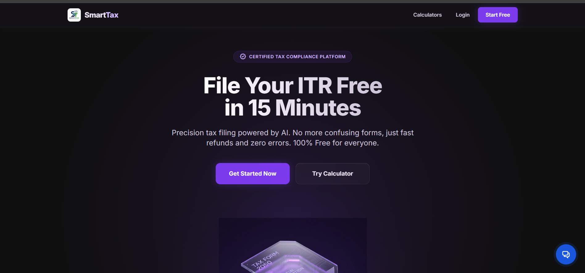
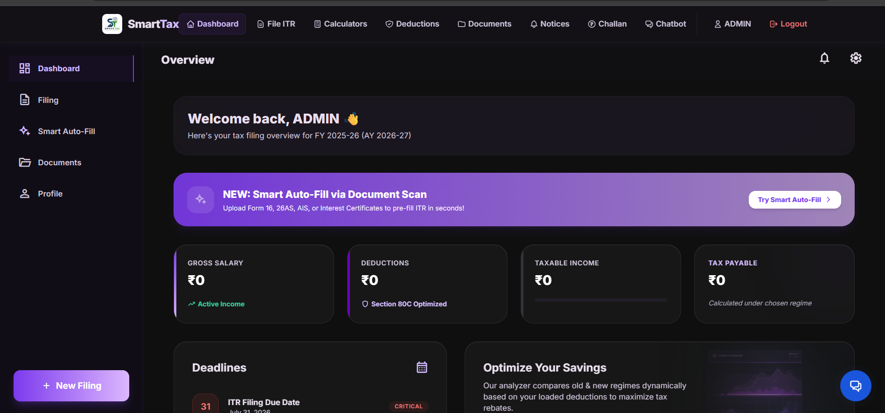
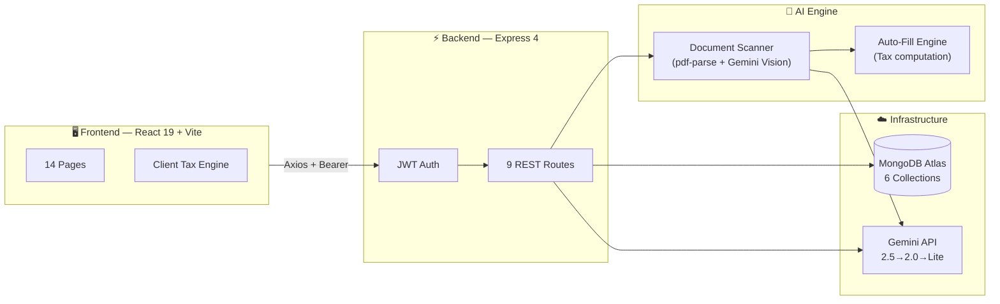
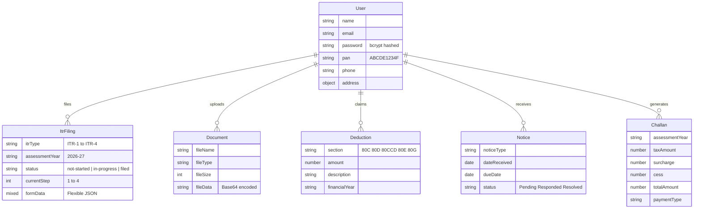

<div align="center">

<!-- ═══════════════════════════════════════════════════════════════ -->
<!-- HERO SECTION -->
<!-- ═══════════════════════════════════════════════════════════════ -->


<br/>

<!-- ANIMATED TYPING -->
<a href="https://vinyx.tech">

</a>

<br/><br/>

<!-- PRIMARY BADGES -->
<a href="https://vinyx.tech"></a>

<a href="LICENSE"></a>

<a href="https://github.com/Vinaysukhwal/SmartTax/stargazers"></a>

<a href="https://github.com/Vinaysukhwal/SmartTax/network/members"></a>

<br/><br/>

<!-- TECH STACK PILL BADGES -->


<br/><br/>

<code>Intelligent document scanning • Automated ITR preparation • Dual-regime tax computation</code>

</div>

<!-- ═══════════════════════════════════════════════════════════════ -->


## 🖥️ Preview

> **Experience it live** → **[vinyx.tech](https://vinyx.tech)**

<div align="center">
<table>
<tr>
<td>
<h3 align="center">📋 Dashboard — Filing Command Center</h3>

<p align="center"><sub><b>Real-time ITR status</b> • Wizard progress tracker • Deduction tiles (80C/80D/80CCD) • Document vault stats<br/>Notice alerts with countdowns • Quick-action cards for active AY</sub></p>
</td>
</tr>
</table>

<table>
<tr>
<td>
<h3 align="center">📊 Smart Analytics — AI Intelligence Layer</h3>

<p align="center"><sub><b>Gemini-powered scan results</b> with confidence scores • Dual-regime comparison (Old vs New FY 2025-26)<br/>Recharts slab breakdowns • TDS reconciliation from Form 16/26AS/AIS • Refund estimator</sub></p>
</td>
</tr>
</table>
</div>

<!-- ═══════════════════════════════════════════════════════════════ -->


## ✨ What Makes SmartTax Different

<table>
<tr>
<td align="center" width="33%">
<br/>
<picture>
  
</picture>
<br/><br/>
<b>AI Document Scanner</b>
<br/><sub>
Drop Form 16, 26AS, AIS, or bank certificates.<br/>
Gemini Vision extracts every field — zero manual entry.
</sub>
<br/><br/>
</td>
<td align="center" width="33%">
<br/>
<picture>
  
</picture>
<br/><br/>
<b>Dual-Regime Tax Engine</b>
<br/><sub>
Old & New regime (FY 2025-26) with Section 87A<br/>
rebate, marginal relief, surcharge & 4% cess.
</sub>
<br/><br/>
</td>
<td align="center" width="33%">
<br/>
<picture>
  
</picture>
<br/><br/>
<b>4-Step ITR Wizard</b>
<br/><sub>
Personal Info → Income → Deductions → Tax<br/>
Auto-save, progress tracking & regime recommendation.
</sub>
<br/><br/>
</td>
</tr>
<tr>
<td align="center" width="33%">
<br/>
<picture>
  
</picture>
<br/><br/>
<b>Smart Dashboard</b>
<br/><sub>
Income breakdowns, slab distribution,<br/>
TDS reconciliation & regime comparison.
</sub>
<br/><br/>
</td>
<td align="center" width="33%">
<br/>
<picture>
  
</picture>
<br/><br/>
<b>Document Vault</b>
<br/><sub>
Secure storage with file detection,<br/>
upload history & instant auto-fill.
</sub>
<br/><br/>
</td>
<td align="center" width="33%">
<br/>
<picture>
  
</picture>
<br/><br/>
<b>AI Tax Assistant</b>
<br/><sub>
Gemini chatbot for tax queries, section<br/>
explanations & regime guidance — every page.
</sub>
<br/><br/>
</td>
</tr>
</table>

<details>
<summary>&nbsp;&nbsp;<b>📋 See all 12 modules</b></summary>
<br/>

<div align="center">

| &nbsp; | Module | Description |
|:---:|:---|:---|
| 📄 | **AI Document Scanner** | Gemini multimodal vision extracts structured data from 6 document types |
| 🧮 | **Tax Calculator** | Income tax, HRA exemption & capital gains (STCG/LTCG) calculators |
| 🧙 | **ITR Filing Wizard** | 4-step guided flow with auto-save and auto-fill from scanned docs |
| 📊 | **Smart Dashboard** | AI analytics with Recharts — slab breakdown, regime comparison |
| 🎯 | **ITR Recommender** | Analyzes income sources → suggests ITR-1 through ITR-4 |
| 🗄️ | **Document Vault** | Secure upload, storage & management with scan integration |
| 💰 | **Deductions Tracker** | Progress bars showing utilization against 80C/80D/80CCD/80E/80G limits |
| 📬 | **Notice Manager** | IT department notice tracking with type, due date & status workflow |
| 🧾 | **Challan 280 Generator** | Compute payment challans with tax + surcharge + cess breakdown |
| 🤖 | **AI Chatbot** | Gemini-powered tax assistant — floating widget + full-page mode |
| 👤 | **Profile Manager** | PAN validation, address & bank details management |
| 🔐 | **Auth System** | JWT-based registration & login with bcrypt password hashing |

</div>

</details>

<!-- ═══════════════════════════════════════════════════════════════ -->


## 🧠 How It Works



<div align="center">

| Layer | Stack |
|:---|:---|
| **Frontend** | React 19 · React Router 7 · Tailwind CSS 3 · Recharts · React Dropzone · jsPDF |
| **Backend** | Express 4 · JWT · bcrypt · Multer · pdf-parse · Sharp |
| **AI** | Google Gemini 2.5 Flash (multimodal) · Structured JSON extraction · 3-model fallback chain |
| **Data** | MongoDB Atlas · Mongoose 8 · 6 collections (User, ItrFiling, Document, Deduction, Notice, Challan) |
| **Deploy** | Vercel (frontend SPA) · Render (API server) · CORS-secured REST |

</div>

<!-- ═══════════════════════════════════════════════════════════════ -->


## 🚀 Get Started in 60 Seconds

> **You need:** Node.js `≥ 18` · [MongoDB Atlas](https://mongodb.com/atlas) · [Gemini API Key](https://aistudio.google.com/apikey) (free)

```bash
# Clone
git clone https://github.com/Vinaysukhwal/SmartTax.git && cd SmartTax

# Install everything
cd server && npm install && cd ../client && npm install && cd ..

# Configure
cp server/.env.example server/.env        # Edit with your MongoDB URI, JWT secret & Gemini key
echo "VITE_API_URL=http://localhost:5000/api" > client/.env
```

```bash
# Launch (2 terminals)
cd server && npm run dev                   # API → http://localhost:5000
cd client && npm run dev                   # UI  → http://localhost:5173
```

<div align="center">

🎉 **Open [localhost:5173](http://localhost:5173)** — demo account `demo@smarttax.com` / `demouser123` is auto-seeded

</div>

<details>
<summary>&nbsp;&nbsp;<b>🔐 Environment Variables Reference</b></summary>
<br/>

| Variable | Location | Required | Description |
|:---|:---|:---:|:---|
| `MONGODB_URI` | `server/.env` | ✅ | MongoDB Atlas connection string |
| `JWT_SECRET` | `server/.env` | ✅ | Secret key for JWT signing |
| `GEMINI_API_KEY` | `server/.env` | ✅ | Google Gemini API key |
| `CORS_ORIGIN` | `server/.env` | ✅ | Frontend URL (e.g. `http://localhost:5173`) |
| `PORT` | `server/.env` | ❌ | API port — defaults to `5000` |
| `VITE_API_URL` | `client/.env` | ✅ | Backend URL (e.g. `http://localhost:5000/api`) |

</details>

<!-- ═══════════════════════════════════════════════════════════════ -->


## 📁 Codebase

<details>
<summary>&nbsp;&nbsp;<b>View full project structure</b></summary>
<br/>

```
SmartTax/
│
├─ client/                           ⚛️  React 19 + Vite
│  └─ src/
│     ├─ pages/                      14 page components
│     │  ├─ Dashboard.jsx               Main filing hub
│     │  ├─ SmartDashboard.jsx          AI analytics workspace
│     │  ├─ ItrWizard.jsx               4-step ITR filing wizard
│     │  ├─ Calculator.jsx              Tax / HRA / Capital gains
│     │  ├─ DocumentVault.jsx           File upload & management
│     │  ├─ DeductionsPage.jsx          Section-wise tracker
│     │  ├─ NoticesPage.jsx             IT notice manager
│     │  ├─ ChallanPage.jsx             Challan 280 generator
│     │  ├─ Chatbot.jsx                 Full-page AI assistant
│     │  ├─ AuthPage.jsx                Login & registration
│     │  ├─ LandingPage.jsx             Marketing page
│     │  ├─ ProfilePage.jsx             User profile editor
│     │  ├─ ItrRecommenderPage.jsx      ITR form selector
│     │  └─ FileItrPage.jsx             Filing entry point
│     ├─ components/                 Navbar · Footer · ChatBot · ProtectedRoute
│     ├─ context/                    AuthContext · LoadingContext
│     ├─ utils/taxCalculations.js    Client-side tax engine
│     ├─ config/api.js               Axios instance
│     └─ App.jsx                     Root component + routing
│
├─ server/                           🟢 Express 4 REST API
│  ├─ index.js                       Entry point + route mounting
│  ├─ config/db.js                   MongoDB connection + retry + seed
│  ├─ middleware/auth.js             JWT verification
│  ├─ models/                        6 Mongoose schemas
│  ├─ routes/                        9 Express route handlers
│  └─ services/
│     ├─ documentScanner.js          Gemini vision extraction
│     └─ autoFillEngine.js           Tax computation engine
│
├─ .github/                          Issue templates · PR template
├─ assets/                           Project screenshots
├─ AGENTS.md · CONTRIBUTING.md · SECURITY.md · LICENSE
└─ render.yaml                       Render deployment config
```

</details>

<details>
<summary>&nbsp;&nbsp;<b>View data model diagram</b></summary>
<br/>



</details>

<!-- ═══════════════════════════════════════════════════════════════ -->


## 🤝 Contributing

We love contributions! Read the **[Contributing Guide](CONTRIBUTING.md)** to get started.

```
fork → git checkout -b feature/your-idea → commit → push → pull request
```

<div align="center">

[](https://github.com/Vinaysukhwal/SmartTax/issues)
&nbsp;&nbsp;
[](https://github.com/Vinaysukhwal/SmartTax/pulls)

</div>

See also: **[Security Policy](SECURITY.md)** · **[Project Rules](AGENTS.md)**

<!-- ═══════════════════════════════════════════════════════════════ -->


## 📄 License

This project is licensed under the **[MIT License](LICENSE)**.

---

<!-- ═══════════════════════════════════════════════════════════════ -->
<!-- FOOTER -->
<!-- ═══════════════════════════════════════════════════════════════ -->

<div align="center">

<br/>

<a href="https://vinyx.tech"></a>
&nbsp;
<a href="https://github.com/Vinaysukhwal"></a>
&nbsp;
<a href="mailto:sukhwal.vinay11@gmail.com"></a>

<br/><br/>

⭐ **Star this repo if SmartTax made tax season less painful**

<br/>


</div>
