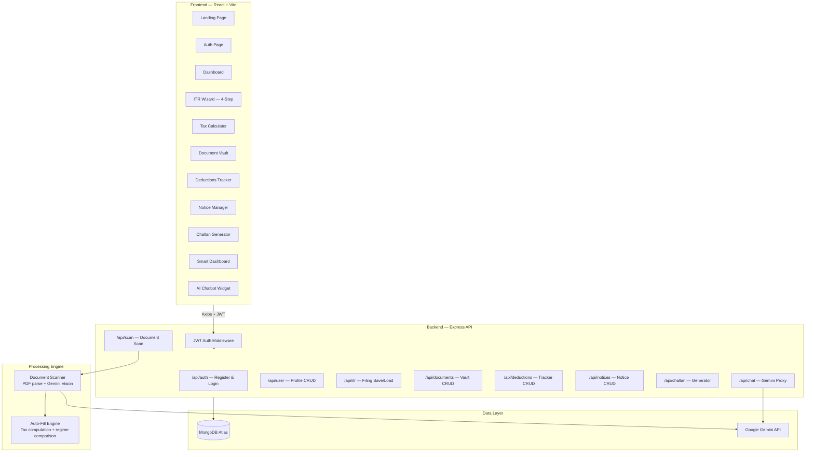

<div align="center">

# 💰 SmartTax

### **AI-Powered Indian Income Tax Filing Platform**

*Intelligent document scanning, automated ITR preparation, and dual-regime tax computation — built for the modern Indian taxpayer.*

[](https://vinyx.tech)
[](LICENSE)
[](https://github.com/Vinaysukhwal/SmartTax/stargazers)
[]()

---

</div>

## 📱 Interface Preview

### Primary Dashboard — Command Center

<p align="center">
  
</p>

> The main workspace surfaces a unified filing hub with real-time ITR status tracking, a multi-step wizard progress indicator, quick-access tiles for deductions (80C/80D/80CCD), document vault statistics, notice alerts with due-date countdowns, and contextual action cards for the active assessment year. The sidebar navigation provides one-click routing to every module in the platform.

---

### Analytics & Smart Processing View

<p align="center">
  
</p>

> The analytics workspace showcases SmartTax's AI-driven intelligence layer — Gemini-powered document scanning results with confidence scores, a dual-regime tax comparison (Old vs New for FY 2025-26), interactive Recharts-based slab breakdowns, TDS reconciliation tables aggregated from Form 16/26AS/AIS, and a real-time refund/payable estimator with regime recommendation engine.

---

## ⚙️ Tech Stack

| Layer | Technologies |
|---|---|
| **Frontend UI** | React 19 · React Router 7 · Tailwind CSS 3 · Recharts · React Dropzone · jsPDF |
| **Core Logic** | Dual-regime tax engine (Old & New FY 2025-26) · Slab calculator · HRA/Capital Gains modules · Auto-fill compiler |
| **AI Services** | Google Gemini 2.5 Flash (multimodal vision) · Structured JSON extraction · Multi-model fallback chain |
| **Backend API** | Express 4 · JWT auth · bcrypt · Multer · pdf-parse · Sharp |
| **Data Layer** | MongoDB (Mongoose 8) · 6 collections (User, ItrFiling, Document, Deduction, Notice, Challan) |
| **Infrastructure** | Vercel (frontend) · Render (API) · MongoDB Atlas · CORS-secured REST API |

---

## 🏗️ System Architecture



---

## 🔑 Core Features

<table>
<tr>
<td width="50%">

### 📄 AI Document Scanner
Drag-and-drop Form 16, 26AS, AIS, Form 16A, bank certificates, and capital gains statements. The Gemini multimodal vision API extracts structured financial data with confidence scoring — no manual data entry.

### 🧮 Dual-Regime Tax Engine
Full slab-based computation for both Old and New regimes (FY 2025-26 / AY 2026-27) with Section 87A rebate logic, marginal relief, surcharge tiers, and 4% Health & Education cess.

### 🧙 4-Step ITR Wizard
Guided filing flow covering Personal Info → Income Details → Deductions (80C/80D/80CCD/80E/80G) → Tax Computation with auto-save, progress tracking, and regime recommendation.

</td>
<td width="50%">

### 📊 Smart Dashboard
AI-powered analytics with Recharts visualizations — income breakdowns, slab-wise tax distribution, TDS reconciliation, and Old vs New regime comparison with automatic recommendation.

### 🗄️ Document Vault
Encrypted document storage with base64 persistence, file type detection, upload history, and direct integration with the scan engine for instant auto-fill.

### 🤖 AI Tax Assistant
Gemini-powered conversational chatbot for real-time tax queries, section explanations, and regime-specific guidance — available as a floating widget on every page.

</td>
</tr>
</table>

### Additional Modules

| Module | Capability |
|---|---|
| **ITR Recommender** | Analyzes income sources to suggest the correct ITR form (ITR-1 through ITR-4) |
| **Deductions Tracker** | CRUD interface with progress bars showing utilization against section-wise limits |
| **Notice Manager** | Track IT department notices with type classification, due dates, and status workflow |
| **Challan 280 Generator** | Compute and generate tax payment challans with surcharge and cess breakdown |
| **Tax Calculator** | Standalone calculators for income tax, HRA exemption, and capital gains (STCG/LTCG) |
| **Profile Manager** | User profile with PAN validation (regex: `^[A-Z]{5}[0-9]{4}[A-Z]$`), address, and bank details |

---

## 🚀 Getting Started

### Prerequisites

| Requirement | Version |
|---|---|
| Node.js | `≥ 18.x` |
| npm | `≥ 9.x` |
| MongoDB | Atlas (cloud) or local `≥ 6.x` |
| Google Gemini API Key | [Get one free →](https://aistudio.google.com/apikey) |

### Installation

```bash
# 1. Clone the repository
git clone https://github.com/Vinaysukhwal/SmartTax.git
cd SmartTax

# 2. Install server dependencies
cd server
npm install

# 3. Configure server environment
cp .env.example .env
# Edit .env and set:
#   MONGODB_URI=mongodb+srv://<user>:<pass>@cluster.mongodb.net/smarttax
#   JWT_SECRET=your-secure-secret-key
#   GEMINI_API_KEY=your-gemini-api-key
#   CORS_ORIGIN=http://localhost:5173

# 4. Install client dependencies
cd ../client
npm install

# 5. Configure client environment
echo "VITE_API_URL=http://localhost:5000/api" > .env
```

### Running Locally

```bash
# Terminal 1 — Start the API server (port 5000)
cd server
npm run dev

# Terminal 2 — Start the React dev server (port 5173)
cd client
npm run dev
```

Open **http://localhost:5173** — a demo account (`demo@smarttax.com` / `demouser123`) is auto-seeded on first launch.

### Production Build

```bash
# Build optimized client bundle
cd client
npm run build

# The output in client/dist/ is deployed to Vercel
# The server is deployed to Render via render.yaml
```

---

## 📁 Project Structure

```
SmartTax/
├── client/                          # React 19 + Vite frontend
│   ├── src/
│   │   ├── pages/                   # 14 page-level components
│   │   │   ├── LandingPage.jsx      #   → Public marketing page
│   │   │   ├── AuthPage.jsx         #   → Login & registration
│   │   │   ├── Dashboard.jsx        #   → Main user dashboard
│   │   │   ├── SmartDashboard.jsx   #   → AI analytics workspace
│   │   │   ├── ItrWizard.jsx        #   → 4-step ITR filing wizard
│   │   │   ├── Calculator.jsx       #   → Tax/HRA/Capital gains calc
│   │   │   ├── DocumentVault.jsx    #   → File upload & management
│   │   │   ├── DeductionsPage.jsx   #   → Section-wise deduction tracker
│   │   │   ├── NoticesPage.jsx      #   → IT notice manager
│   │   │   ├── ChallanPage.jsx      #   → Challan 280 generator
│   │   │   ├── Chatbot.jsx          #   → Full-page AI assistant
│   │   │   ├── ItrRecommenderPage   #   → ITR form selector
│   │   │   ├── FileItrPage.jsx      #   → Filing entry point
│   │   │   └── ProfilePage.jsx      #   → User profile editor
│   │   ├── components/              # Shared UI components
│   │   │   ├── Navbar.jsx           #   → Top navigation bar
│   │   │   ├── Footer.jsx           #   → Site footer
│   │   │   ├── ChatBot.jsx          #   → Floating AI widget
│   │   │   └── ProtectedRoute.jsx   #   → Auth route guard
│   │   ├── context/                 # React Context providers
│   │   │   ├── AuthContext.jsx      #   → JWT auth state manager
│   │   │   └── LoadingContext.jsx   #   → Global loading state
│   │   ├── utils/
│   │   │   └── taxCalculations.js   #   → Client-side tax engine
│   │   ├── config/
│   │   │   └── api.js               #   → Axios instance config
│   │   ├── App.jsx                  #   → Root component + routing
│   │   └── main.jsx                 #   → Vite entry point
│   ├── tailwind.config.js
│   ├── vite.config.js
│   └── vercel.json                  # SPA rewrite rules
│
├── server/                          # Express 4 REST API
│   ├── index.js                     # Server entry — route mounting
│   ├── config/
│   │   └── db.js                    # MongoDB connection + demo seed
│   ├── middleware/
│   │   └── auth.js                  # JWT verification middleware
│   ├── models/                      # Mongoose schemas
│   │   ├── User.js                  #   → bcrypt-hashed user accounts
│   │   ├── ItrFiling.js             #   → ITR form data (flexible Mixed)
│   │   ├── Document.js              #   → Base64 file storage
│   │   ├── Deduction.js             #   → Section-wise deductions
│   │   ├── Notice.js                #   → IT notice tracking
│   │   └── Challan.js               #   → Tax payment records
│   ├── routes/                      # Express route handlers
│   │   ├── auth.js                  #   → Register + Login
│   │   ├── user.js                  #   → Profile CRUD
│   │   ├── itr.js                   #   → ITR filing save/load
│   │   ├── scan.js                  #   → Document scan orchestrator
│   │   ├── documents.js             #   → Vault CRUD
│   │   ├── deductions.js            #   → Deduction CRUD
│   │   ├── notices.js               #   → Notice CRUD
│   │   ├── challan.js               #   → Challan CRUD
│   │   └── chat.js                  #   → Gemini chat proxy
│   ├── services/                    # Business logic layer
│   │   ├── documentScanner.js       #   → Gemini vision extraction
│   │   └── autoFillEngine.js        #   → Tax computation engine
│   └── render.yaml                  # Render deployment config
│
├── assets/                          # Project screenshots
├── CONTRIBUTING.md
├── AGENTS.md
└── README.md
```

---

## 📊 Data Models

```
┌──────────────┐     ┌──────────────┐     ┌──────────────┐
│     User     │────<│  ItrFiling   │     │   Document   │
│──────────────│     │──────────────│     │──────────────│
│ name         │     │ itrType      │     │ fileName     │
│ email        │     │ assessmentYr │     │ fileType     │
│ password ⊕   │     │ status       │     │ fileSize     │
│ pan          │     │ currentStep  │     │ fileData ◆   │
│ phone        │     │ formData {}  │     └──────────────┘
│ address {}   │     └──────────────┘            │
└──────────────┘            │               userId ref
       │            ┌──────────────┐     ┌──────────────┐
       ├───────────<│  Deduction   │     │   Challan    │
       │            │──────────────│     │──────────────│
       │            │ section      │     │ assessmentYr │
       │            │ amount       │     │ taxAmount    │
       │            │ description  │     │ surcharge    │
       │            │ financialYr  │     │ cess         │
       │            └──────────────┘     │ totalAmount  │
       │                                 │ paymentType  │
       └────────────────────────────────<└──────────────┘
                    ┌──────────────┐
                    │    Notice    │
                    │──────────────│
              ──────│ noticeType   │
                    │ dateReceived │
                    │ dueDate      │
                    │ status       │
                    │ notes        │
                    └──────────────┘

⊕ = bcrypt hashed    ◆ = base64 encoded    {} = Mixed/flexible schema
```

---

## 🤝 Contributing

We welcome contributions from the community. Please read our **[Contributing Guide](CONTRIBUTING.md)** for detailed guidelines on:

- Forking and branching conventions
- Commit message standards (Conventional Commits)
- Pull request process and code review expectations

---

## 📄 License

This project is licensed under the **MIT License** — see the [LICENSE](LICENSE) file for details.

---

<div align="center">

**Built with precision by [vinyx.tech](https://vinyx.tech)**

[](https://vercel.com)
[](https://render.com)
[](https://www.mongodb.com/atlas)

⭐ Star this repo if SmartTax saved you time this tax season

</div>
