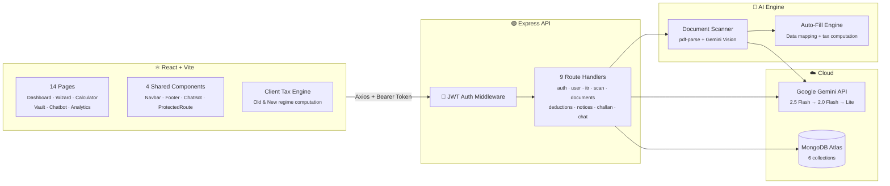
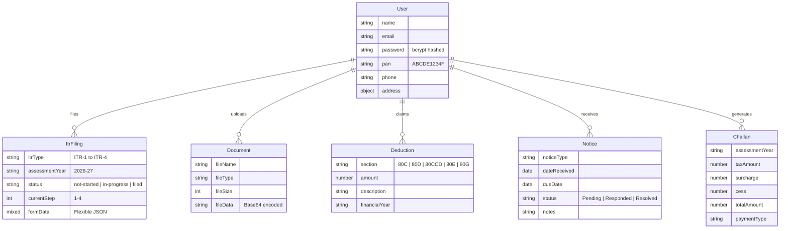

<div align="center">

<!-- GRADIENT HEADER -->


<br/>


<br/><br/>

<!-- BADGES ROW -->
<a href="https://vinyx.tech"></a>
&nbsp;
<a href="LICENSE"></a>
&nbsp;
<a href="https://github.com/Vinaysukhwal/SmartTax/stargazers"></a>
&nbsp;
<a href="https://github.com/Vinaysukhwal/SmartTax/network/members"></a>

</div>

<br/>

<!-- TECH BADGES -->
<p align="center">


</p>

---

## 📸 Screenshots

<table>
<tr>
<td>

<div align="center">
<strong>🏠 Dashboard — Filing Command Center</strong>
</div>

<br/>


<br/>

<sup>Real-time ITR status • Wizard progress tracker • Deduction tiles (80C/80D/80CCD) • Document vault stats • Notice alerts with due-date countdowns • Quick-action cards for active AY</sup>

</td>
</tr>
<tr>
<td>

<div align="center">
<strong>📊 Smart Analytics — AI Processing View</strong>
</div>

<br/>


<br/>

<sup>Gemini-powered scan results with confidence scores • Dual-regime tax comparison (Old vs New FY 2025-26) • Recharts slab breakdowns • TDS reconciliation from Form 16/26AS/AIS • Refund estimator with regime recommendation</sup>

</td>
</tr>
</table>

---

## ✨ Features

<table>
<tr>
<td align="center" width="33%">
<br/>

<br/><br/>
<strong>AI Document Scanner</strong>
<br/><br/>
<sub>Drag-and-drop Form 16, 26AS, AIS, Form 16A, bank certificates & capital gains statements. Gemini multimodal vision extracts structured data with confidence scoring.</sub>
<br/><br/>
</td>
<td align="center" width="33%">
<br/>

<br/><br/>
<strong>Dual-Regime Tax Engine</strong>
<br/><br/>
<sub>Full slab computation for Old & New regimes (FY 2025-26) with Section 87A rebate, marginal relief, surcharge tiers, and 4% Health & Education cess.</sub>
<br/><br/>
</td>
<td align="center" width="33%">
<br/>

<br/><br/>
<strong>4-Step ITR Wizard</strong>
<br/><br/>
<sub>Guided filing: Personal Info → Income → Deductions (80C/80D/80CCD/80E/80G) → Tax Computation with auto-save and regime recommendation.</sub>
<br/><br/>
</td>
</tr>
<tr>
<td align="center" width="33%">
<br/>

<br/><br/>
<strong>Smart Dashboard</strong>
<br/><br/>
<sub>AI-powered analytics with Recharts — income breakdowns, slab distribution, TDS reconciliation, and Old vs New regime comparison.</sub>
<br/><br/>
</td>
<td align="center" width="33%">
<br/>

<br/><br/>
<strong>Document Vault</strong>
<br/><br/>
<sub>Secure document storage with base64 persistence, file type detection, upload history, and direct integration with the scan engine.</sub>
<br/><br/>
</td>
<td align="center" width="33%">
<br/>

<br/><br/>
<strong>AI Tax Assistant</strong>
<br/><br/>
<sub>Gemini-powered chatbot for real-time tax queries, section explanations, and regime guidance — floating widget on every page.</sub>
<br/><br/>
</td>
</tr>
</table>

<details>
<summary><strong>📋 See all modules</strong></summary>
<br/>

| Module | What it does |
|:---|:---|
| **ITR Recommender** | Analyzes income sources → suggests correct form (ITR-1 through ITR-4) |
| **Deductions Tracker** | CRUD interface with progress bars against section-wise limits |
| **Notice Manager** | Track IT notices with type classification, due dates & status workflow |
| **Challan 280 Generator** | Compute and generate payment challans with surcharge + cess breakdown |
| **Tax Calculator** | Standalone calculators for income tax, HRA exemption & capital gains |
| **Profile Manager** | PAN validation (`^[A-Z]{5}[0-9]{4}[A-Z]$`), address & bank details |

</details>

---

## 🏗️ Architecture



---

## 🚀 Quick Start

> **Prerequisites:** Node.js `≥ 18`, npm `≥ 9`, [MongoDB Atlas](https://www.mongodb.com/atlas) account, [Gemini API key](https://aistudio.google.com/apikey)

### 1️⃣ Clone & Install

```bash
git clone https://github.com/Vinaysukhwal/SmartTax.git && cd SmartTax
```

```bash
# Install both client and server
cd server && npm install && cd ../client && npm install && cd ..
```

### 2️⃣ Configure Environment

```bash
# Server
cd server && cp .env.example .env
```

Edit `server/.env`:
```env
MONGODB_URI=mongodb+srv://<user>:<pass>@cluster.mongodb.net/smarttax
JWT_SECRET=your-secret-key
GEMINI_API_KEY=your-gemini-api-key
CORS_ORIGIN=http://localhost:5173
```

```bash
# Client
echo "VITE_API_URL=http://localhost:5000/api" > client/.env
```

### 3️⃣ Launch

```bash
# Terminal 1 — API (port 5000)
cd server && npm run dev

# Terminal 2 — UI (port 5173)
cd client && npm run dev
```

Open **http://localhost:5173** — demo account `demo@smarttax.com` / `demouser123` is auto-seeded.

---

<details>
<summary><strong>📁 Project Structure</strong></summary>
<br/>

```
SmartTax/
│
├─ client/                           ⚛️  React 19 + Vite
│  └─ src/
│     ├─ pages/                      14 page components
│     │  ├─ Dashboard.jsx               Main filing hub
│     │  ├─ SmartDashboard.jsx          AI analytics workspace
│     │  ├─ ItrWizard.jsx               4-step ITR filing wizard
│     │  ├─ Calculator.jsx              Tax / HRA / Cap gains
│     │  ├─ DocumentVault.jsx           File upload & management
│     │  ├─ DeductionsPage.jsx          Section-wise tracker
│     │  ├─ NoticesPage.jsx             IT notice manager
│     │  ├─ ChallanPage.jsx             Challan 280 generator
│     │  ├─ Chatbot.jsx                 Full-page AI assistant
│     │  ├─ AuthPage.jsx                Login & registration
│     │  ├─ LandingPage.jsx             Marketing page
│     │  ├─ ProfilePage.jsx             User profile editor
│     │  ├─ ItrRecommenderPage.jsx      ITR form selector
│     │  └─ FileItrPage.jsx             Filing entry point
│     ├─ components/                 Navbar, Footer, ChatBot, ProtectedRoute
│     ├─ context/                    AuthContext, LoadingContext
│     ├─ utils/taxCalculations.js    Client-side tax engine
│     ├─ config/api.js               Axios instance
│     └─ App.jsx                     Root + routing
│
├─ server/                           🟢 Express 4 REST API
│  ├─ index.js                       Entry point + route mounting
│  ├─ config/db.js                   MongoDB connection + retry + seed
│  ├─ middleware/auth.js             JWT verification
│  ├─ models/                        6 Mongoose schemas
│  │  ├─ User.js                        bcrypt-hashed accounts
│  │  ├─ ItrFiling.js                   Flexible Mixed form data
│  │  ├─ Document.js                    Base64 file storage
│  │  ├─ Deduction.js                   Section-wise deductions
│  │  ├─ Notice.js                      IT notice tracking
│  │  └─ Challan.js                     Tax payment records
│  ├─ routes/                        9 Express route handlers
│  └─ services/
│     ├─ documentScanner.js          Gemini vision extraction
│     └─ autoFillEngine.js           Tax computation engine
│
├─ assets/                           Screenshots
├─ .github/                          Issue & PR templates
├─ AGENTS.md                         AI/developer instructions
├─ CONTRIBUTING.md                   Contribution guidelines
├─ SECURITY.md                       Security policy
├─ LICENSE                           MIT License
└─ render.yaml                       Render deployment config
```

</details>

<details>
<summary><strong>📊 Data Models</strong></summary>
<br/>



</details>

---

## 🤝 Contributing

Contributions are welcome! Please read the **[Contributing Guide](CONTRIBUTING.md)** before opening a PR.

```bash
fork → git checkout -b feature/your-feature → commit → push → PR
```

See also: [Security Policy](SECURITY.md) · [Code of Conduct](CONTRIBUTING.md#code-of-conduct)

---

## 📄 License

Distributed under the **MIT License**. See [LICENSE](LICENSE) for details.

---

<div align="center">

<br/>

<strong>Built by <a href="https://vinyx.tech">vinyx.tech</a></strong>

<br/>

<a href="https://vinyx.tech"></a>
&nbsp;
<a href="https://github.com/Vinaysukhwal"></a>

<br/><br/>

**If SmartTax helped you, consider giving it a ⭐**

<br/>


</div>
